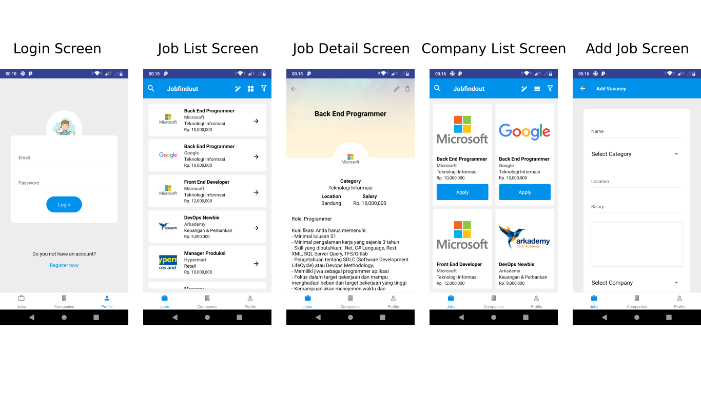

## Introduction

This is my personal project to pass bootcamp fourth task and this is mobile apps for my github repesitory (jobposting - backend). This is open source and feel free to use and bought me.

## Back End

For the back end you can clone on this project: https://github.com/nukumalik/jobposting

## Screenshots

## Prerequiste

-   Node.js
-   Yarn
-   React Native CLI
-   Android SDK

## Installation

### Clone

    $ git clone https://github.com/nukumalik/ReactNativeJobposting.git
    $ cd ReactNativeJobposting
    $ npm install

### Start Development App

    $ react-native run-android
    $ yarn start

### Other Depedencies

-   @react-native-community/async-storage
-   axios
-   native-base
-   react
-   react-native
-   react-native-drawer
-   react-native-gesture-handler
-   react-native-reanimated
-   react-native-responsive-screen
-   react-native-screens
-   react-native-vector-icons
-   react-navigation
-   react-navigation-stack
-   react-navigation-tabs
-   react-number-format
-   react-redux
-   redux
-   redux-form
-   redux-logger
-   redux-promise-middleware
